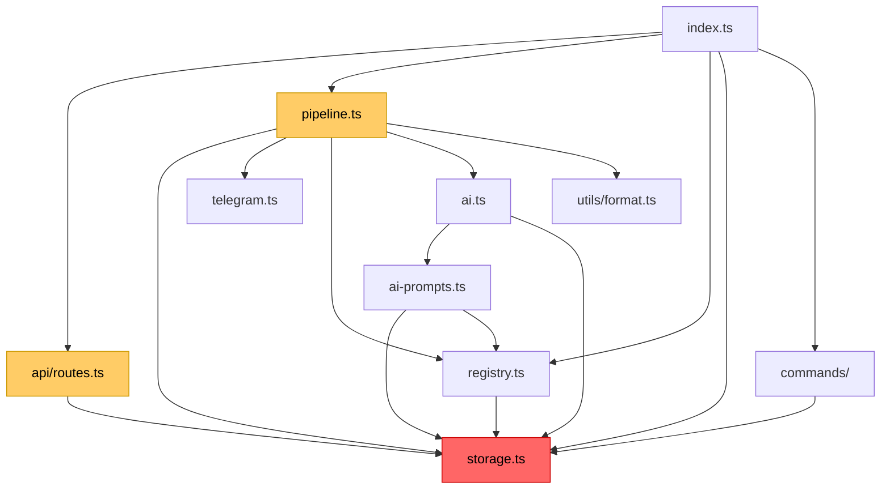

# REFACTORING ANALYSIS REPORT

**Generated**: 10-02-2026 18:11:42
**Target**: `feature/d1-overhaul` branch (1 commit ahead of `feature/simplify`)
**Analyst**: Claude Refactoring Specialist
**Report ID**: refactor_d1-overhaul_10-02-2026_181142

---

## EXECUTIVE SUMMARY

The `feature/d1-overhaul` branch adds significant D1 database capabilities: run tracking, job status lifecycle, per-source cron scheduling, REST API, settings table, and KV→D1 migration for prompt configs. The changes are **+1441 / -209 lines across 18 files**.

**Primary concern**: `storage.ts` has become a **637-line god module** with 31 exported functions spanning 7 distinct responsibility domains (KV dedup, D1 runs, D1 jobs, D1 sources, D1 settings, D1 paginated queries, KV admin). This is the #1 refactoring target.

**Secondary concerns**:
1. **Zero test coverage** for all new D1 functions (runs, settings, paginated queries, dashboard, saveJobOnFetch, updateJobStatus)
2. **Unauthenticated PATCH/PUT API endpoints** that modify production data
3. `processJobs()` grew to 248 lines with deeply interwoven run-tracking logic
4. `api/routes.ts` is a single 147-line function with 20 regex/conditional branches

**Estimated effort**: 3-4 days for full refactoring + tests. Can be done incrementally.

---

## CURRENT STATE ANALYSIS

### Commit Under Analysis

```
cc7e662 feat: Add per-source cron scheduling + AI model in D1 + smart admin notifications
```

### File Metrics Summary

| File | Lines | Functions | Exports | Change | Status |
|------|-------|-----------|---------|--------|--------|
| `src/services/storage.ts` | **637** | 25 | 31 | +343 | CRITICAL |
| `src/services/pipeline.ts` | **385** | 3 | 2 | +133 | HIGH |
| `src/api/routes.ts` | **147** | 1 (new) | 1 | +147 | MEDIUM |
| `src/types.ts` | 144 | 0 | 8 types | +86 | OK |
| `src/services/sources/registry.ts` | 283 | 12 | 9 | +43 | OK |
| `src/index.ts` | 148 | 3 | 1 | +26 | OK |
| `src/services/telegram.ts` | 232 | 8 | 5 | +12 | OK |
| `src/services/ai-prompts.ts` | 119 | 6 | 5 | -2 net | OK |
| `src/services/ai.ts` | 237 | 6 | 3 | +14 | OK |
| `src/services/commands/prompt.ts` | 202 | 10 | 1 | -10 net | OK |
| `src/utils/format.ts` | 176 | 4 | 3 | +3 | OK |
| `migrations/0001_database_overhaul.sql` | 55 | — | — | +55 | OK |
| `wrangler.toml` | — | — | — | +3 | OK |

### Code Smell Analysis

| Code Smell | Severity | Location | Description |
|------------|----------|----------|-------------|
| **God Module** | CRITICAL | `storage.ts` | 637 lines, 31 exports, 7 responsibility domains |
| **Long Function** | HIGH | `processJobs()` | 248 lines, run tracking + D1 saves interwoven with core pipeline |
| **Monolithic Router** | MEDIUM | `routes.ts` | Single function, 20 regex/conditional branches, no modularity |
| **No Tests** | HIGH | All new D1 functions | 0 tests for 15+ new exported functions |
| **Security Gap** | HIGH | `routes.ts` | PATCH/PUT endpoints completely unauthenticated |
| **Type Assertion** | LOW | `prompt.ts:98` | `as any` cast in `updateSourceInDB` call |
| **Null Hack** | LOW | `prompt.ts:82,86` | `null as unknown as string` for resetting ai_prompt_config |
| **Legacy Compat** | LOW | `saveJobToDatabase()` | Kept as "legacy compat" but still called nowhere — dead code? |

---

## COMPLEXITY ANALYSIS

### storage.ts — Function-Level Metrics

| Function | Lines | Cyclomatic | Nesting | Risk | Domain |
|----------|-------|------------|---------|------|--------|
| `isJobPosted` | 5 | 1 | 0 | LOW | KV dedup |
| `markJobAsPosted` | 16 | 1 | 0 | LOW | KV dedup |
| `isDuplicateJob` | 9 | 1 | 0 | LOW | KV dedup |
| `markDedupKey` | 9 | 1 | 0 | LOW | KV dedup |
| `getPostedJob` | 17 | 3 | 1 | LOW | KV dedup |
| `createRun` | 16 | 1 | 0 | LOW | D1 runs |
| `completeRun` | 31 | 2 | 0 | LOW | D1 runs |
| `saveJobOnFetch` | **37** | 2 | 1 | MEDIUM | D1 jobs |
| `updateJobStatus` | **33** | 4 | 2 | MEDIUM | D1 jobs |
| `saveJobToDatabase` | **38** | 2 | 1 | MEDIUM | D1 jobs (legacy?) |
| `getSourcesFromDB` | 5 | 1 | 0 | LOW | D1 sources |
| `getSourceFromDB` | 4 | 1 | 0 | LOW | D1 sources |
| `updateSourceInDB` | **26** | 8 | 1 | HIGH | D1 sources |
| `getSourceStats` | 10 | 1 | 0 | LOW | D1 sources |
| `getSetting` | 5 | 1 | 0 | LOW | D1 settings |
| `setSetting` | 5 | 1 | 0 | LOW | D1 settings |
| `listJobs` | **39** | 5 | 1 | HIGH | D1 queries |
| `getJobFromDB` | 4 | 1 | 0 | LOW | D1 queries |
| `listRuns` | 22 | 1 | 0 | LOW | D1 queries |
| `getRunFromDB` | 5 | 1 | 0 | LOW | D1 queries |
| `getDashboardStats` | **31** | 2 | 1 | MEDIUM | D1 queries |
| `getTodayRuns` | 6 | 1 | 0 | LOW | D1 queries |
| `listRecentJobs` | 27 | 3 | 2 | LOW | KV admin |
| `getJobById` | 19 | 3 | 1 | LOW | KV admin |
| `deleteJobFromKV` | 3 | 1 | 0 | LOW | KV admin |
| `deleteDedupKey` | 3 | 1 | 0 | LOW | KV admin |
| `getPostedJobRecord` | 10 | 2 | 1 | LOW | KV admin |
| `searchJobsInKV` | 8 | 2 | 1 | LOW | KV admin |
| `clearAllKV` | 18 | 2 | 1 | LOW | KV admin |

**Key insight**: No single function is extremely complex. The problem is **breadth, not depth** — 7 unrelated domains crammed into one file. The fix is modular extraction, not function refactoring.

### pipeline.ts — Function-Level Metrics

| Function | Lines | Cyclomatic | Nesting | Risk |
|----------|-------|------------|---------|------|
| `buildSummary` | 30 | 5 | 2 | LOW |
| `processJobs` | **248** | ~18 | 4 | HIGH |
| `sendDailySummary` | 68 | 6 | 3 | MEDIUM |

`processJobs()` is the only truly complex function. Its high cyclomatic complexity comes from interwoven concerns: source fetching, dedup, KV checks, D1 saves, AI summarization, Telegram posting, run tracking, and admin notifications — all in one function.

### routes.ts — Complexity

| Function | Lines | Branches | Regex Matches | Risk |
|----------|-------|----------|---------------|------|
| `handleApiRoute` | 147 | 20 | 6 regex | MEDIUM |

Single function handling 10 distinct API endpoints with regex URL matching. Not complex per-function, but violates SRP and is hard to extend.

---

## DEPENDENCY ANALYSIS

### Import Graph (d1-overhaul branch)

```
index.ts
├── api/routes.ts ─── storage.ts (12 imports)
├── pipeline.ts
│   ├── storage.ts (8 imports)
│   ├── telegram.ts
│   ├── sources/registry.ts (3 imports from DB funcs)
│   ├── ai.ts
│   └── utils/format.ts
├── commands/
│   └── prompt.ts ─── storage.ts (4 imports)
├── sources/registry.ts ─── storage.ts (1 import)
├── ai-prompts.ts ─── storage.ts (2 imports)
└── ai.ts ─── storage.ts (1 import)
```

**storage.ts is imported by 6 files** — it's the central hub. Any refactoring must maintain backward-compatible exports (re-export barrel).

### Circular Dependencies

None detected. Import flow is strictly one-directional.

---

## TEST COVERAGE ANALYSIS

### Current Coverage Map

| Source File | Test File | Coverage | Status |
|-------------|-----------|----------|--------|
| `storage.ts` (KV functions) | `storage.test.ts` | ~70% | Existing, unchanged |
| `storage.ts` (D1 runs) | — | **0%** | NO TESTS |
| `storage.ts` (D1 jobs: saveJobOnFetch, updateJobStatus) | — | **0%** | NO TESTS |
| `storage.ts` (D1 sources: getSourcesFromDB, updateSourceInDB) | — | **0%** | NO TESTS |
| `storage.ts` (D1 settings) | — | **0%** | NO TESTS |
| `storage.ts` (D1 queries: listJobs, listRuns, getDashboardStats) | — | **0%** | NO TESTS |
| `api/routes.ts` | — | **0%** | NO TESTS |
| `pipeline.ts` (processJobs — run tracking additions) | — | **0%** | NO TESTS |
| `pipeline.ts` (sendDailySummary) | — | **0%** | NO TESTS |
| `telegram.ts` (TelegramSendResult return type) | `telegram.test.ts` | ~90% | Updated |
| `ai-prompts.ts` (D1 reads) | `ai.test.ts` | ~85% | Updated |
| `ai.ts` (getAIModel D1 fallback) | — | **0%** | NO TESTS |
| `registry.ts` (getEnabledSourcesFromDB, getHashtagsFromDB) | — | **0%** | NO TESTS |

**Critical gap**: 15+ new exported functions with zero test coverage. The entire D1 layer is untested.

### Tests Modified (updated correctly)

- `ai.test.ts`: Mock changed from KV to D1. Tests pass with new D1-backed `getPromptConfig`.
- `telegram.test.ts`: Assertions updated from `boolean` to `TelegramSendResult` objects.

---

## SECURITY ANALYSIS

### Unauthenticated Write Endpoints

| Endpoint | Method | Risk | Impact |
|----------|--------|------|--------|
| `PATCH /api/sources/:id` | PATCH | **HIGH** | Can disable sources, change cron schedules, modify AI prompt configs |
| `PUT /api/settings/:key` | PUT | **HIGH** | Can change AI model, prompt templates, any setting |

**Comment in code**: `"All endpoints are unauthenticated (public job data)."`
**Reality**: PATCH and PUT endpoints **modify** data, not just read it.

### Recommendation

Add at minimum a shared secret header check (`X-API-Key`) for write endpoints. The admin chat ID or a separate `API_SECRET` env var would work.

---

## REFACTORING PLAN

### Phase 1: Split storage.ts (CRITICAL — Highest ROI)

**Current**: 637-line god module with 31 exports across 7 domains.
**Target**: 7 focused modules under `src/services/storage/` with barrel re-export.

#### Proposed Structure

```
src/services/storage/
├── index.ts          # Re-export barrel (backward compatible imports)
├── kv-dedup.ts       # isJobPosted, markJobAsPosted, isDuplicateJob, markDedupKey, getPostedJob
├── kv-admin.ts       # listRecentJobs, getJobById, deleteJobFromKV, deleteDedupKey, etc.
├── d1-jobs.ts        # saveJobOnFetch, updateJobStatus, saveJobToDatabase, getJobFromDB, listJobs
├── d1-runs.ts        # createRun, completeRun, getRunFromDB, listRuns, getTodayRuns
├── d1-sources.ts     # getSourcesFromDB, getSourceFromDB, updateSourceInDB, getSourceStats
├── d1-settings.ts    # getSetting, setSetting
└── d1-dashboard.ts   # getDashboardStats (aggregates across tables)
```

#### Extraction Details

| Module | Functions to Extract | Lines | From Lines | Risk |
|--------|---------------------|-------|------------|------|
| `kv-dedup.ts` | 5 functions | ~56 | 1-88 | LOW |
| `kv-admin.ts` | 7 functions + 2 interfaces | ~83 | 501-637 | LOW |
| `d1-runs.ts` | 5 functions | ~68 | 93-147, 424-499 | LOW |
| `d1-jobs.ts` | 5 functions | ~120 | 149-272, 372-419 | LOW |
| `d1-sources.ts` | 4 functions | ~55 | 277-339 | LOW |
| `d1-settings.ts` | 2 functions | ~16 | 344-363 | LOW |
| `d1-dashboard.ts` | 1 function | ~31 | 459-489 | LOW |
| `index.ts` | Re-exports only | ~15 | — | LOW |

**Backward compatibility**: The barrel `index.ts` re-exports everything, so all existing imports (`from '../storage'` or `from './storage'`) continue working with zero changes to consumers.

#### BEFORE (current)

```typescript
// src/services/storage.ts — 637 lines, 31 exports
import type { Env, PostedJobRecord, ProcessedJob, JobStatus, JobRecord, SourceRecord, RunRecord, PaginatedResponse } from '../types';

// KV — Deduplication
export async function isJobPosted(...) { ... }
export async function markJobAsPosted(...) { ... }
// ... 5 more KV functions ...

// D1 — Runs
export async function createRun(...) { ... }
// ... 4 more run functions ...

// D1 — Jobs
export async function saveJobOnFetch(...) { ... }
// ... 4 more job functions ...

// D1 — Sources, Settings, Queries, Admin...
// ... 17 more functions ...
```

#### AFTER (refactored)

```typescript
// src/services/storage/kv-dedup.ts — ~56 lines
import type { Env, PostedJobRecord } from '../../types';
export async function isJobPosted(...) { ... }
export async function markJobAsPosted(...) { ... }
// 3 more focused functions

// src/services/storage/d1-runs.ts — ~68 lines
import type { Env, RunRecord, PaginatedResponse } from '../../types';
export async function createRun(...) { ... }
export async function completeRun(...) { ... }
// 3 more focused functions

// src/services/storage/index.ts — barrel
export * from './kv-dedup';
export * from './kv-admin';
export * from './d1-jobs';
export * from './d1-runs';
export * from './d1-sources';
export * from './d1-settings';
export * from './d1-dashboard';
```

**Estimated time**: 1-2 hours (pure file splitting, no logic changes).

---

### Phase 2: Add Tests for New D1 Functions (HIGH — Safety Net)

**Missing tests for 15+ new functions.** Priority order:

| Priority | Function(s) | Test Count | Est. Time |
|----------|-------------|------------|-----------|
| P0 | `createRun`, `completeRun` | 4 tests | 30 min |
| P0 | `saveJobOnFetch`, `updateJobStatus` | 6 tests | 45 min |
| P1 | `listJobs` (pagination, filters, search) | 5 tests | 30 min |
| P1 | `updateSourceInDB` | 3 tests | 20 min |
| P1 | `getSetting`, `setSetting` | 3 tests | 15 min |
| P2 | `getDashboardStats` | 2 tests | 15 min |
| P2 | `listRuns`, `getRunFromDB` | 3 tests | 15 min |
| P2 | `handleApiRoute` (routes.ts) | 8 tests | 1 hour |
| P2 | `sendDailySummary` | 3 tests | 30 min |
| P2 | `getEnabledSourcesFromDB`, `getHashtagsFromDB` | 4 tests | 20 min |
| P3 | `getAIModel` D1 fallback chain | 2 tests | 10 min |

**Approach**: Mock D1 database (same pattern already used in `ai.test.ts` with `mockD1()`).

**Estimated time**: 4-6 hours for full coverage.

---

### Phase 3: Refactor routes.ts (MEDIUM)

**Current**: Single 147-line `handleApiRoute()` function with 6 regex matches and 20 conditional branches.

**Target**: Route table pattern or split into handler functions.

#### Option A: Route Handler Functions (Recommended)

```typescript
// src/api/routes.ts — dispatcher only
import { handleListJobs, handleGetJob } from './handlers/jobs';
import { handleListSources, handleGetSource, handleUpdateSource } from './handlers/sources';
import { handleListRuns, handleGetRun } from './handlers/runs';
import { handleGetStats } from './handlers/stats';
import { handleGetSetting, handleUpdateSetting } from './handlers/settings';

const routes: Array<{ pattern: RegExp; method: string; handler: RouteHandler }> = [
  { pattern: /^\/api\/jobs$/, method: 'GET', handler: handleListJobs },
  { pattern: /^\/api\/jobs\/(.+)$/, method: 'GET', handler: handleGetJob },
  // ...
];

export async function handleApiRoute(request: Request, url: URL, env: Env): Promise<Response | null> {
  for (const route of routes) {
    if (url.pathname.match(route.pattern) && request.method === route.method) {
      return route.handler(request, url, env);
    }
  }
  return null;
}
```

#### Option B: Keep Flat, Extract Handlers Only

Keep the if-chain in `handleApiRoute` but extract each block into a named handler function. Less structural change, still improves readability.

**Estimated time**: 1-2 hours.

---

### Phase 4: Extract sendDailySummary from pipeline.ts (LOW)

`sendDailySummary()` (68 lines) is a self-contained reporting function that doesn't share state with `processJobs()`. It imports from storage and telegram.

**Move to**: `src/services/notifications.ts` or `src/services/daily-summary.ts`.

**Estimated time**: 30 minutes.

---

### Phase 5: Security — Add Auth to Write Endpoints (MEDIUM)

Add API key authentication for mutating endpoints:

```typescript
function requireAuth(request: Request, env: Env): Response | null {
  const key = request.headers.get('X-API-Key');
  if (!key || key !== env.API_SECRET) {
    return jsonResponse({ error: 'Unauthorized' }, 401);
  }
  return null;
}
```

Apply to PATCH `/api/sources/:id` and PUT `/api/settings/:key`.

**Estimated time**: 30 minutes.

---

### Phase 6: Clean Up Minor Issues (LOW)

| Issue | Location | Fix |
|-------|----------|-----|
| `null as unknown as string` hack | `prompt.ts:82,86` | Make `updateSourceInDB` accept `null` for nullable fields |
| `as any` type assertion | `prompt.ts:98` | Fix `updateSourceInDB` field types to accept partial updates properly |
| Dead code? `saveJobToDatabase()` | `storage.ts:235` | Verify if still called anywhere; remove if dead |
| Duplicated regex matching | `routes.ts:70,80` | Same regex runs twice for GET vs PATCH on sources |

**Estimated time**: 1 hour.

---

## RISK ASSESSMENT

### Risk Matrix

| Risk | Likelihood | Impact | Score | Mitigation |
|------|------------|--------|-------|------------|
| Breaking imports after storage split | Low | High | 3 | Barrel re-export pattern |
| Introducing bugs in tests with D1 mocks | Medium | Medium | 4 | Follow existing `mockD1()` pattern from ai.test.ts |
| Route refactor breaking API contracts | Low | Medium | 2 | No logic changes, just structural |
| Missing edge cases in new D1 functions | Medium | High | 6 | Comprehensive test coverage (Phase 2) |

### Rollback Strategy

All phases are pure structural refactoring — no logic changes. If any phase introduces issues:
1. `git revert` the refactoring commit
2. All phases are independent and can be done/reverted separately
3. Barrel re-exports ensure zero consumer breakage

---

## IMPLEMENTATION CHECKLIST

```json
[
  {"id": "1", "content": "Create backup: git branch backup/d1-overhaul-pre-refactor", "priority": "critical"},
  {"id": "2", "content": "Phase 1: Split storage.ts into storage/ directory with 7 modules + barrel index", "priority": "high"},
  {"id": "3", "content": "Phase 1: Verify all imports still resolve after split (typecheck)", "priority": "high"},
  {"id": "4", "content": "Phase 2: Add D1 mock helpers (extend mockD1 pattern from ai.test.ts)", "priority": "high"},
  {"id": "5", "content": "Phase 2: Write tests for d1-runs (createRun, completeRun)", "priority": "high"},
  {"id": "6", "content": "Phase 2: Write tests for d1-jobs (saveJobOnFetch, updateJobStatus)", "priority": "high"},
  {"id": "7", "content": "Phase 2: Write tests for d1-queries (listJobs pagination/filters)", "priority": "high"},
  {"id": "8", "content": "Phase 2: Write tests for d1-sources (updateSourceInDB)", "priority": "medium"},
  {"id": "9", "content": "Phase 2: Write tests for api/routes.ts endpoints", "priority": "medium"},
  {"id": "10", "content": "Phase 2: Write tests for sendDailySummary", "priority": "medium"},
  {"id": "11", "content": "Phase 3: Refactor routes.ts into route table + handler functions", "priority": "medium"},
  {"id": "12", "content": "Phase 4: Extract sendDailySummary to notifications.ts", "priority": "low"},
  {"id": "13", "content": "Phase 5: Add X-API-Key auth to PATCH/PUT endpoints", "priority": "medium"},
  {"id": "14", "content": "Phase 6: Fix null hack in prompt.ts, remove dead code", "priority": "low"},
  {"id": "15", "content": "Run full test suite: npm test", "priority": "high"},
  {"id": "16", "content": "Run typecheck: npm run typecheck", "priority": "high"}
]
```

---

## SUCCESS METRICS

| Metric | Current | Target | Notes |
|--------|---------|--------|-------|
| `storage.ts` lines | 637 | 0 (split into 7 files, each <120 lines) | God module eliminated |
| Largest file | 637 (`storage.ts`) | <250 (`pipeline.ts`) | After split |
| New function test coverage | 0% | >80% | 15+ untested functions |
| Unauthenticated write endpoints | 2 | 0 | Auth added |
| `as any` / `as unknown` hacks | 3 | 0 | Proper typing |
| `processJobs()` length | 248 lines | 248 (unchanged this round) | Future target for Phase 2 refactor |

---

## APPENDIX A: Complete File Size Comparison

| File | `feature/simplify` | `d1-overhaul` | Delta |
|------|-------------------|---------------|-------|
| `src/services/storage.ts` | 294 | **637** | +343 |
| `src/services/pipeline.ts` | 252 | **385** | +133 |
| `src/api/routes.ts` | — | **147** | +147 (new) |
| `src/types.ts` | 58 | 144 | +86 |
| `src/services/sources/registry.ts` | 240 | 283 | +43 |
| `src/index.ts` | 122 | 148 | +26 |
| `src/services/telegram.ts` | 220 | 232 | +12 |
| `src/services/ai.ts` | 223 | 237 | +14 |
| `src/services/commands/prompt.ts` | 212 | 202 | -10 |
| `src/services/ai-prompts.ts` | 121 | 119 | -2 |
| `src/utils/format.ts` | 173 | 176 | +3 |
| `migrations/0001_database_overhaul.sql` | — | 55 | +55 (new) |

## APPENDIX B: Dependency Graph



**Legend**: Red = critical refactoring target, Orange = secondary target

## APPENDIX C: Migration Safety

The `migrations/0001_database_overhaul.sql` is well-written:
- Uses `IF NOT EXISTS` for tables and indexes (idempotent)
- Uses `ALTER TABLE ADD COLUMN` for existing table expansion
- **Caveat**: SQLite `ALTER TABLE ADD COLUMN` silently succeeds if column already exists in newer versions, but may fail in older ones. The migration should be tested against the D1 SQLite version.
- All new columns have sensible defaults (`DEFAULT 'posted'`, `DEFAULT '0 * * * *'`, `DEFAULT (datetime('now'))`)

---

*This report serves as a comprehensive guide for refactoring execution.
Reference this document when implementing: `reports/refactor/refactor_d1-overhaul_10-02-2026_181142.md`*
